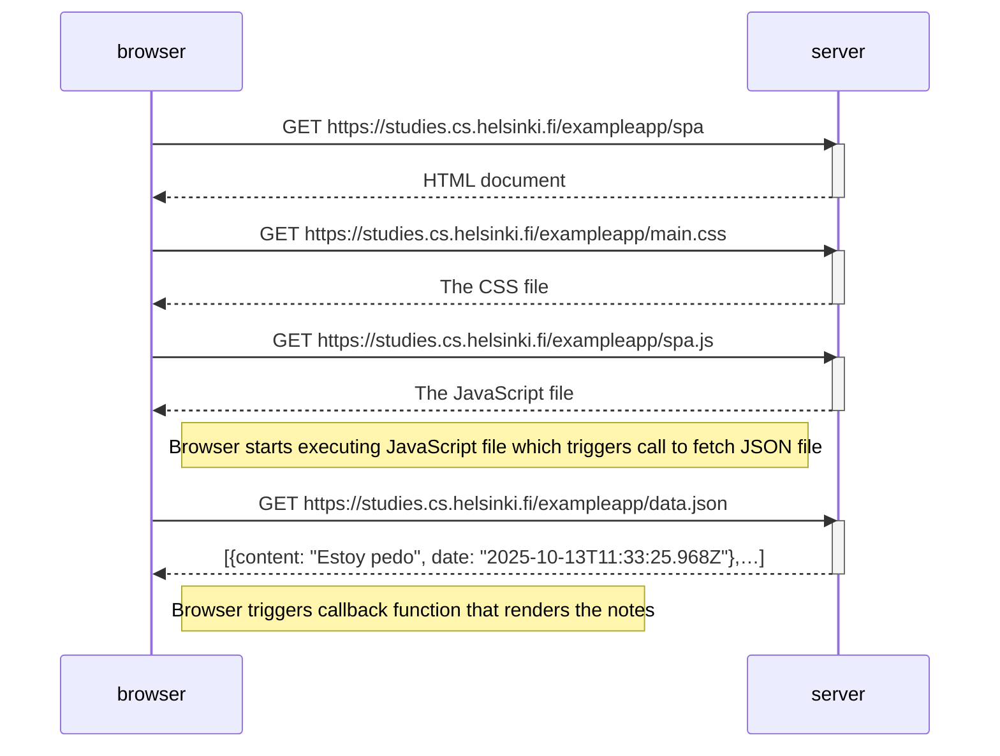

```mermaid
sequenceDiagram
    participant browser
    participant server

    browser->>server: GET https://studies.cs.helsinki.fi/exampleapp/spa
    activate server
    server-->>browser: HTML document
    deactivate server

    browser->>server: GET https://studies.cs.helsinki.fi/exampleapp/main.css
    activate server
    server-->>browser: The CSS file
    deactivate server

    browser->>server: GET https://studies.cs.helsinki.fi/exampleapp/spa.js
    activate server
    server-->>browser: The JavaScript file
    deactivate server

    Note right of browser: Browser starts executing JavaScript file which triggers call to fetch JSON file

    browser->>server: GET https://studies.cs.helsinki.fi/exampleapp/data.json
    activate server
    server-->>browser: [{content: "Estoy pedo", date: "2025-10-13T11:33:25.968Z"},…]
    deactivate server

    Note right of browser: Browser triggers callback function that renders the notes
```