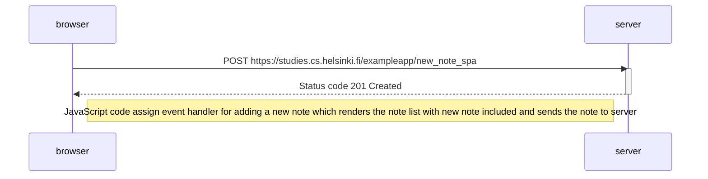

```mermaid
sequenceDiagram
    participant browser
    participant server

    browser->>server: POST https://studies.cs.helsinki.fi/exampleapp/new_note_spa
    activate server
    server-->>browser: Status code 201 Created
    deactivate server

    Note right of browser: JavaScript code assign event handler for adding a new note which renders the note list with new note included and sends the note to server
```